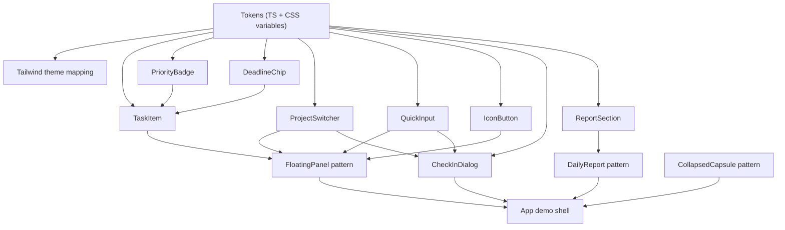

# Component Dependency Map

```mermaid
graph TD
  Tokens["Tokens (TS + CSS variables)"] --> Tailwind["Tailwind theme mapping"]
  Tokens --> TaskItem["TaskItem"]
  Tokens --> Badge["PriorityBadge"]
  Tokens --> Deadline["DeadlineChip"]
  Tokens --> Switcher["ProjectSwitcher"]
  Tokens --> QuickInput["QuickInput"]
  Tokens --> IconButton["IconButton"]
  Tokens --> CheckIn["CheckInDialog"]
  Tokens --> Report["ReportSection"]

  Badge --> TaskItem
  Deadline --> TaskItem
  Switcher --> Panel["FloatingPanel pattern"]
  QuickInput --> Panel
  IconButton --> Panel
  TaskItem --> Panel

  Switcher --> CheckIn
  QuickInput --> CheckIn
  Report --> DailyReport["DailyReport pattern"]

  Panel --> App["App demo shell"]
  CheckIn --> App
  DailyReport --> App
  Capsule["CollapsedCapsule pattern"] --> App
```
